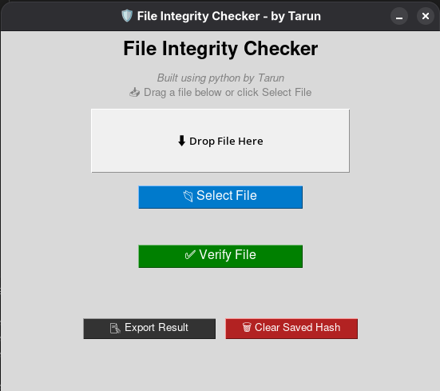

# 🛡️ File Integrity Checker


<p align="center">
  
</p>


> A lightweight and user-friendly GUI application that helps you verify whether a file has been tampered with, by comparing cryptographic hash values like SHA-256 and MD5. Built with Python and Tkinter, and packaged as an AppImage for Linux systems.

---

## 📸 Screenshot




---

## 🚀 Features

- 📂 File selection with file dialog or drag & drop
- 🔒 Calculates SHA-256 and MD5 hash values
- ✅ Compares file hash with expected original hash
- 💻 Cross-platform Python GUI (Windows/Linux compatible)
- 📦 Distributed as a portable `.AppImage`
- 💡 Offline functionality

---

## 🧠 How It Works

1. Select a file using the file picker or drag and drop it into the app.
2. The application calculates the hash of the file (SHA-256 and MD5).
3. Paste the original hash value to compare.
4. The app notifies whether the file is intact or has been modified.

---

## 🔧 Tech Stack

- **Python 3**
- **Tkinter** (GUI)
- **hashlib** (hashing)
- **PyInstaller & AppImage** (packaging)

---

## 📁 Project Structure

```
.
├── Filechecker.py                  # Main Python app
├── fileintegrity.png              # Icon used in app and AppImage
├── FileIntegrityChecker.desktop   # (Optional) Linux shortcut
├── FileIntegrityChecker-x86_64.AppImage  # Final packaged app
├── recipe.yml                     # AppImage build config
├── README.md                      # This file
└── assets/
    └── screenshot.png             # UI screenshot
```

---

## 🏗️ Installation / Usage

### ✅ Run on Linux

1. Download the latest `.AppImage` file from the [Releases](https://github.com/YourGitHubUsername/FileIntegrityChecker/releases)
2. Make it executable:

```bash
chmod +x FileIntegrityChecker-x86_64.AppImage
```

3. Launch the app:

```bash
./FileIntegrityChecker-x86_64.AppImage
```

---

## 👨‍💻 Developer Info

**Author:** Madhihally Arun Kumar Tarun  
**GitHub:** [@MinatoNamikaze25](https://github.com/MinatoNamikaze25)  
**LinkedIn:** [View Profile](https://www.linkedin.com/in/madhihally-arun-kumar-tarun-5bb885287)

---

## 📃 License

This project is licensed under the **MIT License** — see the [LICENSE](LICENSE) file for details.

---

> ⚡ Feel free to fork, contribute, and star the repo if you found it helpful!
